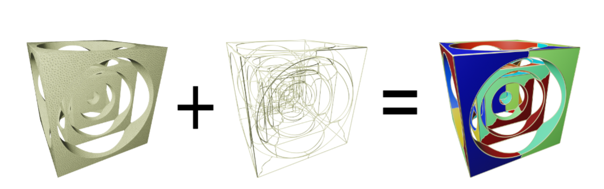
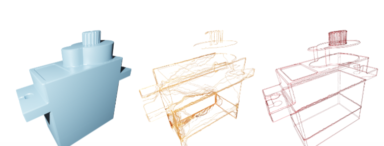
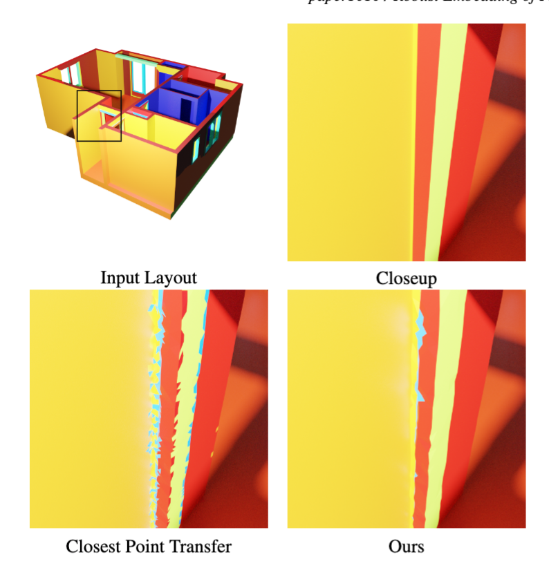
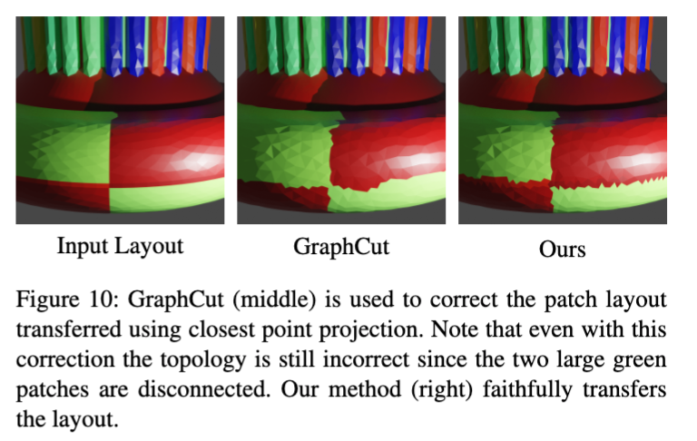
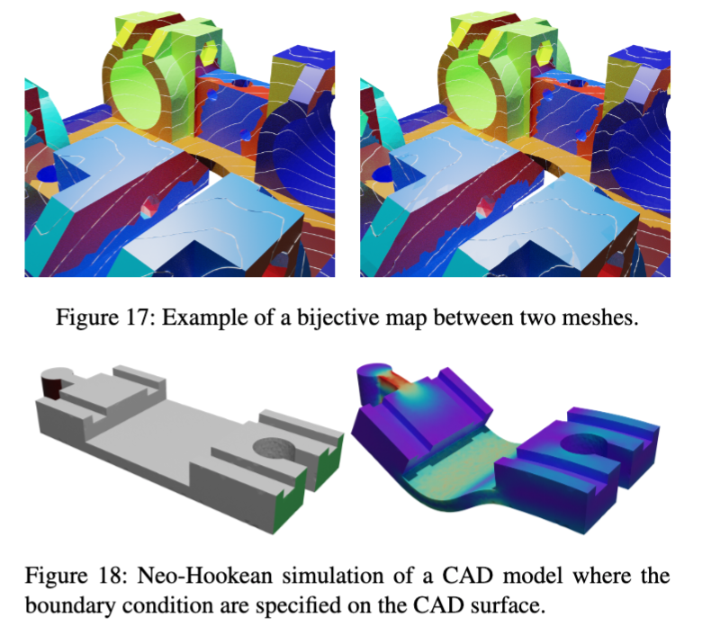
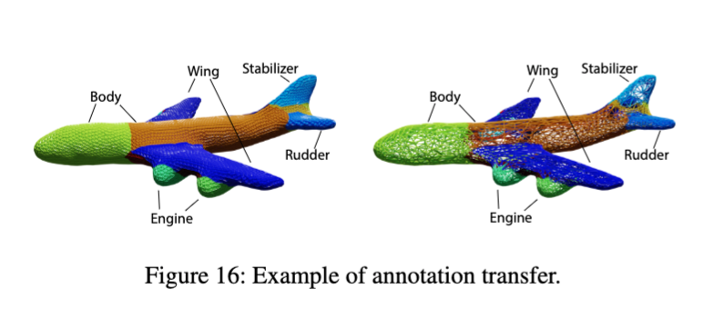

## PatchEmbed
This project try to solve a practical problem re-occuring in the field of geometry processing. How to generate strict correspondence before and after remeshing or how to embed the patch layout from a CAD model to a remeshed model. The tricky part is to make sure the input and output are geometrically similar and topologically identical.



Our algorithm has the following features
1. preserve topology
2. robust
3. will get meaningful results even if the input and target mesh have different surface topology.

Outperform traditional match-maker, nearest neighbor, and graph-cut algorithms.

Compare with match-maker



Compare with nearest neighbor




Compare with Graph cut




Applications



### Installation
To build the binary, run the following code
```shell
git clone 
cd PatchEmbed
mkdir build
cmake ..
make
```

### how to use
The bcclean_bin get the initial parameters from a .json file for example
```shell
cd build
./patchembed -d dir/you/put/obj,yml/in -u upsample_level -b backtrackthreshold, -t tracing_type
```
where a standard set of arguments is provided as
```shell
./PatchEmbed -d ../data/2 -u 0 -b 0.4 -t loop
```


