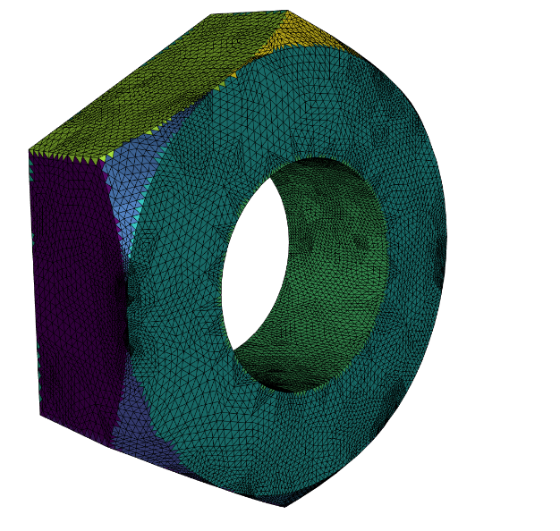
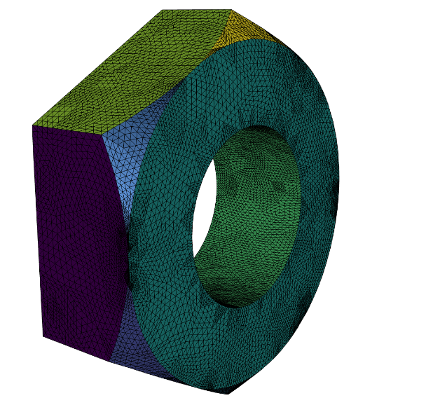

## bcClean

This project try to solve a practical problem many encounters when doing FEM over CAD models. It is ambiguous how to set the boundary condition after mesh repair/ mesh refine. This package provide a lib and UI to transport the boundary condition labels by either nearest neighbor or Euclidean projection followed by a clean up.

### Installation
To run the program, a python interpreter (>3.6) is required and python module yaml, wildmeshing, igl, numpy are necessary. We recommend using a separate anaconda env. To set up the prerequisite
```shell
conda activate env_name
conda install yaml
conda install wildmeshing
conda install igl
```
To build the binary, run the following code
```shell
git clone 
cd bcclean
mkdir build
cmake -DCMAKE_BUILD_TYPE=Release -DPYTHON_EXECUTABLE=/dir/to/your/python/interpreter/python -DPython3_LIBRARIES=/dir/to/your/python/lib/libpython3.7m.dylib ..
make
```

### how to use
The bcclean_bin get the initial parameters from a .json file for example
```shell
cd build
./bcclean_bin -j ../run.json
```
where a standard run.json file is provided as
```jsonc
{
    "lambda_refine":1, // control the graph cut parameter lambda
    "stop_energy": 10, // control the tetwild stopping criterion
    "data_root": "../data/0", // directory to the data folder
    "num_subdiv": 2, // number of sub-division
    "label_num": 6 // label num (set to the number of patches you will use)
}
```
The detailed Usage looks like below


There is also a python binding. In order to install it into your environment. go to the bcclean root dir and run
```shell
pip install ./python/
```
an example script is provided in example.ipynb.
```python
import pybcclean as pbc
import numpy as np
import igl
import meshplot as mp
```
Initially, we have a broken mesh (possibly with self intersection) together with specified boundary condition labeling (in dmat format).
```python
v_bad, f_bad=igl.read_triangle_mesh("data/2/00000006_d4fe04f0f5f84b52bd4f10e4_trimesh_001.obj")
fl_bad = igl.read_dmat("data/2/feat.dmat")
mp.plot(v_bad,f_bad, fl_bad, shading={"wireframe":True})
```


After tetrahedralization, transport the boundary condition label onto the surface mesh, here we read the good mesh directly.
```python
v_good, f_good = igl.read_triangle_mesh("data/2/good_mesh.obj")
prob_mat, fl_good = pbc.project_face_labels(v_bad,f_bad.astype('int32'), fl_bad.astype('int32'),v_good,f_good.astype('int32'))
mp.plot(v_good, f_good,fl_good[:,0], shading={"wireframe": True})
```


This give the initial boundary condition for us to clean
```python
fl_good_cut =pbc.refine_labels(v_good,f_good.astype('int32'),prob_mat,fl_good.astype('int32'),1)
mp.plot(v_good, f_good, fl_good_cut[:,0], shading={"wireframe":True})
```



